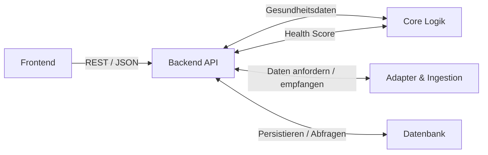

# Architektur

## High-Level-Architektur

Das Projekt ist als Monorepo mit jeweils zwei eigenständigen Submodulen für das Backend und das Frontend strukturiert.
Backend-Repository: [`longevity-backend`](https://github.com/Max-imalgutaussehend/longevity-backend)
Frontend-Repository: [`longevity-frontend`](https://github.com/Max-imalgutaussehend/longevity-frontend)
Das Monorepo [LONGEVITY](https://github.com/Max-imalgutaussehend/LONGEVITY) beinhaltet außerdem einen Ordner [`infra`](https://github.com/Max-imalgutaussehend/LONGEVITY/tree/main/infra), welcher die Infrastrukturkonfiguration für z. B. Docker enthält.

## Schichtenarchitektur

### 1. Frontend als Präsentationsschicht

- **Technologie:** React, TypeScript, Vite, [CSS-Tokens](https://github.com/Max-imalgutaussehend/longevity-frontend/blob/main/src/styles/tokens.css)
- Stellt die Benutzeroberfläche für alle Zielgruppen (B2B, B2C) bereit
- Kommuniziert über [HTTP-Client](https://github.com/Max-imalgutaussehend/longevity-frontend/blob/main/src/api/client.ts) über eine REST-basierte API mit dem Backend und nutzt dafür klar definierte JSON Payloads

### 2. Backend-API

- **Technologie:** Node.js, [Fastify](https://github.com/Max-imalgutaussehend/longevity-backend/blob/main/src/app.ts), TypeScript
- Diese Schicht bildet den Eingang unseres Backends und implementiert die eigentliche [REST-API](https://github.com/Max-imalgutaussehend/longevity-backend/tree/main/src/routes), welche die Anfragen des Frontends entgegennimmt
- Zudem sind hier Authentifizierung, Autorisierung und ein Rate-Limiting implementiert sowie die Orchestrierung des Datenflusses zwischen Datenbank, [Adapterschicht](https://github.com/Max-imalgutaussehend/longevity-backend/tree/main/src/adapters) und der [Core Logik](https://github.com/Max-imalgutaussehend/longevity-backend/tree/main/src/score)

### 3. Core-Logik

- **Technologie:** TypeScript
- Die [Core-Logik](https://github.com/Max-imalgutaussehend/longevity-backend/tree/main/src/score) beinhaltet die [Scoreberechnung](https://github.com/Max-imalgutaussehend/longevity-backend/blob/main/src/score/index.ts) und trennt externe Datenaufrufe klar von unserer mathematischen Berechnungsgrundlage
- Wir implementieren hier keine externen Aufrufe, sondern sorgen für eine isolierte deterministische Berechnung des Health Scores

### 4. Konnektoren und Adapter

- **Technologie:** TypeScript, diverse externe Anbieter-APIs
- Externe Datenformate und die Datenbeschaffung der Gesundheitsanbieter etc. sind in der [Adapter- und Ingestionsschicht](https://github.com/Max-imalgutaussehend/longevity-backend/tree/main/src/adapters) angesiedelt
- Hier sind sämtliche Kommunikationen mit externen Diensten implementiert, um die Daten für die im Core isolierte Scoreberechnung bereitzustellen
- Der Datenimport erfolgt wie folgt:
  - OAuth 2.0: [Withings](https://github.com/Max-imalgutaussehend/longevity-backend/blob/main/src/adapters/withings.ts), [Oura](https://github.com/Max-imalgutaussehend/longevity-backend/blob/main/src/adapters/oura.ts), [Strava](https://github.com/Max-imalgutaussehend/longevity-backend/blob/main/src/adapters/strava.ts), [Google Fit](https://github.com/Max-imalgutaussehend/longevity-backend/blob/main/src/adapters/googleFit.ts)
  - Manueller Import: [Apple Health (zip)](https://github.com/Max-imalgutaussehend/longevity-backend/blob/main/src/adapters/appleHealthZip.ts), [FHIR-Labordaten (json)](https://github.com/Max-imalgutaussehend/longevity-backend/blob/main/src/adapters/fhir.ts)
  - Direkte Eingabe: sonstige Gesundheits- und Lebensstildaten (Rauchen,...)

### 5. Datenbank

- **Technologie:** PostgreSQL, [Drizzle ORM](https://github.com/Max-imalgutaussehend/longevity-backend/blob/main/src/db/schema.ts)
- Persistenz von Nutzer-, Authentifizierungs- und Gesundheitsdaten
- Sensible Daten wie [Krankenkassennummer](https://github.com/Max-imalgutaussehend/longevity-backend/blob/main/src/lib/kvnr.ts), [Passwörter](https://github.com/Max-imalgutaussehend/longevity-backend/blob/main/src/lib/password.ts) etc. werden datenschutzkonform gespeichert und kryptografisch sicher gehasht
