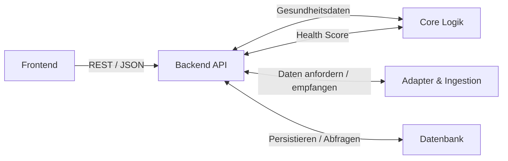

## High-Level-Architektur

Das Projekt ist als Monorepo mit jeweils zwei eigenständigen Submodulen für das Backend und das Frontend strukturiert.
Backend-Repository: [`longevity-backend`](https://github.com/Max-imalgutaussehend/longevity-backend)
Frontend-Repository: [`longevity-frontend`](https://github.com/Max-imalgutaussehend/longevity-frontend)
Das Monorepo LONGEVITY beinhaltet außerdem einen Ordner [`infra`](../infra), welcher die Infrastrukturkonfiguration für z. B. Docker enthält.

## Schichtenarchitektur

### 1. Frontend als Präsentationsschicht

- **Technologie:** React, Typescript, Vite, CSS-Tokens
- Stellt die Benutzeroberfläche für alle Zielgruppen (B2B, B2C) bereit
- Kommuniziert über HTTP-Client über eine REST basierte API mit dem Backend und nutzt dafür klar definierte JSON Payloads

### 2. Backend-API

- **Technologie:** Node.js, Fastify, TypeScript
- Diese Schicht bildet den Eingang unseres Backends und implementiert die eigentliche REST-API, welche die Anfragen des Frontends entgegennimmt
- Zudem sind hier Authentifizierung, Autorisierung und ein Rate-Limiting implementiert wieso die Orchestrierung des Datenflusses zwischen Datenbank, Adapterschicht und der Core Logik

### 3. Core-Logik

- **Technologie:** Typescript
- Die Core-Logik beinhaltet die Scoreberechnung und trennt externe Datenaufrufe klar von unserer mathematischen Berechnungsgrundlage
- Wir implementieren hier keine externen Aufrufe, sondern sorgen für eine isolierte deterministische Berechnung des Health Scores

### 4. Konnektoren und Adapter

- **Technologie:** Typescript, Anbieter APIs, Typescript
- Externe Datenformate und die Datenbeschaffung der Gesundheitsanbieter etc. sind in der Adapter- und Ingestionsschicht angesiedelt
- Hier sind sämtliche Kommunikationen mit externen Diensten implementiert, um die Daten für die im Core isolierte Scoreberechnung bereitzustellen
- Der Datenimport erfolgt wie Folgt:
  - OAuth 2.0: Withings, Oura, Strava, Google Fit
  - Manueller Import: Apple Health (zip), FHIR-Labordaten (json)
  - Direkte Eingabe: sonstige Gesundheits und Lebensstildaten (Rauchen,...)

### 5. Datenbank

- **Technologie:** PostgreSQL, Drizzle ORM
- Persistenz von Nutzer, Authentifizierungs und Gesundheitsdaten
- sensible Daten wie Krankenkassennummer, Passwörter etc. werden datenschutzkonform gespeichert und kryptografisch sicher gehashed
