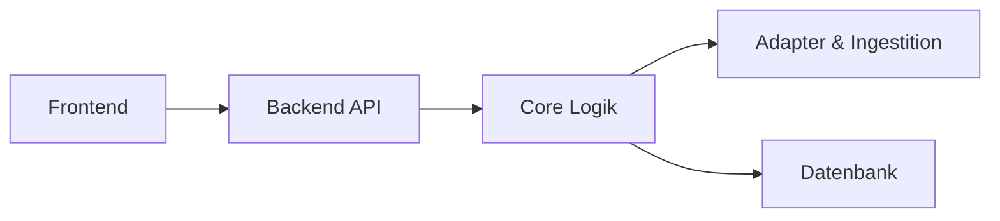

## High Level Architektur

Das Projekt ist als Monorepo mit jeweils zwei eigenständigen Submodulen für das Backend und das Frontend strukturiert.
Backend Repository: `longevity-backend`
Frontend Repository: `longevity-frontend`
Das Monorepo LONGEVITY beinhaltet außerdem einen Ordner `infra` welcher die Infrastrukturkonfiguration für z.B. Docker enthalten.

## Schichtenarchitektur

1. Frontend als Präsentationsschicht
2. Backend API

- Diese Schicht bildet den Eingang unseres Backends und implementiert die eigentliche REST API welche die Anfragen des Frontend entgegegennimmt
- Zudem ist hier Authentifizierung, Authorisierung und ein Rate Limiting implementiert

3. Core Logik

- die Core Logik beinhaltet hauptsächlich die Scoreberechnung und trennt externe Datenaufrufe klar von unserer mathematischen Berechnungsgrundlage
- Wir importieren hier keine externen Aufrufe sondern sorgen für eine isolierte deterministische Berechnung des Health Score

4. Konnektoren und Adapter

- externe Datenformate und die Datenbeschaffung der Gesundheitsanbieter etc. sind in der Adapter und Ingestitionsschicht angesiedelt
- hier sind sämntliche Kommunikationen die auf externen Diensten implementiert um die Daten für die im Core isolierte Scoreberechnung bereit zu stellen

5. Datenbank

- Für die persistenz der Daten verwenden wir eine PostgreSQL Datenbank in Kombination mit Drizzle als ORM
