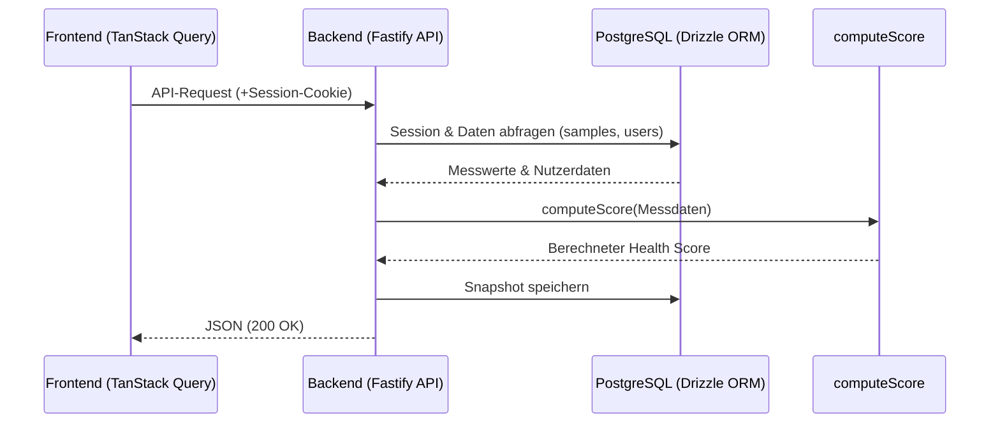

# Frontend und Backend Datenfluss



## Authentifizierung

Bevor die grundlegende Kommunikation zwischen Front- und Backend funktionieren kann, ist es wichtig, dass sich der User authentifiziert, sodass das Backend die nötigen Daten zur Verfügung stellen kann. Sobald sich ein User anmeldet und die Anmeldedaten im Backend als gültig überprüft wurden (E-Mail existiert und der mitgeprüfte Passwort-Hash stimmt überein), wird eine Session-ID erstellt, die in der Datenbank (Tabelle [`sessions`](https://github.com/Max-imalgutaussehend/longevity-backend/blob/main/src/db/schema.ts)) gespeichert wird und dem richtigen User zugeordnet ist.

Diese Session-ID wird danach an das Frontend zurückgesendet - das passiert über einen `Set-Cookie`-Header mit dem Sicherheitsflag `HttpOnly`. Dadurch speichert der JavaScript-Code den Cookie nicht manuell ab, sondern der Webbrowser verwahrt ihn selbstständig in einem geschützten Speicher und sendet es bei jedem weiteren Request automatisch im Hintergrund mit. Da Frontend-JavaScript keinen Lesezugriff auf dieses Cookie hat, ist das Verfahren gegen Angriffe wie durch Cross-Site-Scripting (sogenanntes XSS) geschützt.

## Datenfluss im Frontend

Wenn der User das [Dashboard](https://github.com/Max-imalgutaussehend/longevity-frontend/blob/main/src/routes/Dashboard.tsx) öffnet, sind viele Datenabfragen wichtig. Eine davon ist, welchen Score der User hat. Um diese Anfrage erfolgreich zu erfüllen, wird der Request über das Framework TanStack Query abgehandelt. Dieses Framework erstellt einen Cache, cacht und validiert somit bestimmte Datenpunkte, die abgefragt werden: Sollte ein User seinen Score abfragen, so muss dieser bei erneutem Aufruf nicht jedes Mal sofort vom Backend geliefert werden, sondern kann direkt aus dem Cache angezeigt werden. Somit können Seitenwechsel - wenn der User zum Beispiel von „[Dashboard](https://github.com/Max-imalgutaussehend/longevity-frontend/blob/main/src/routes/Dashboard.tsx)“ auf „[Hebel](https://github.com/Max-imalgutaussehend/longevity-frontend/blob/main/src/routes/Hebel.tsx)“ und wieder zurückgeht - ohne erneute Backend-Anfrage und somit mit sofortiger Informationsanzeige abgehandelt werden.

Dieser Cache gilt standardmäßig für 30 Sekunden als valide (`staleTime: 30_000` ms). Erst danach würde im Hintergrund eine erneute Backend-Anfrage ausgeführt werden, um veraltete Daten zu aktualisieren. Sobald der User selbst eine Änderung vornimmt (u.a. neue Messdaten einträgt), wird der Cache gezielt invalidiert, damit die neu berechneten Aktualisierungen sofort sichtbar werden.

Für Anfragen an das Backend ruft TanStack Query dabei die zentrale Hilfsfunktion [`apiClient`](https://github.com/Max-imalgutaussehend/longevity-frontend/blob/main/src/api/client.ts) auf. Diese setzt die Option `credentials: 'include'` (damit der Browser das geschützte Session-Cookie mitsendet) und fügt bei schreibenden Anfragen (POST/PUT/DELETE) automatisch das CSRF-Schutztoken in den Header ein. Im Frontend existiert zudem die Datei [`frontend/src/api/generated.ts`](https://github.com/Max-imalgutaussehend/longevity-frontend/blob/main/src/api/generated.ts), welche den API-Contract vom Backend direkt ins Frontend einbindet. Damit die beiden Stacks trotzdem lose gekoppelt bleiben, teilen sie sich keine gemeinsamen Code-Dateien. Die Datei wird stattdessen automatisiert durch ein Skript (`pnpm gen:api`) aus der vom Backend bereitgestellten [`backend/openapi.json`](https://github.com/Max-imalgutaussehend/longevity-backend/blob/main/openapi.json) generiert.

## Datenfluss im Backend

API-Anfragen kommen im Backend zuerst bei der Middleware-Pipeline an, bei der wir [Fastify](https://github.com/Max-imalgutaussehend/longevity-backend/blob/main/src/app.ts) als Web-Framework einsetzen. Davon nutzen wir unter anderem `@fastify/helmet`, um über HTTP-Header sicherzustellen, dass keine böswilligen Skripte ausgeführt oder Seiten in fremde Frames eingebettet werden können. Zudem nutzen wir `@fastify/rate-limit`, wodurch wir Anfragen auf 120 Anfragen pro Minute pro IP einschränken (auf sensiblen Routen wie Login noch strenger), um einen DDoS- und Brute-Force-Schutz zu haben. Danach liest ein Cookie-Parser die mitgeschickten Header aus, insbesondere die unter Authentifizierung genannte Session-ID.

Diese Session-ID wird über [`PgSessionStore`](https://github.com/Max-imalgutaussehend/longevity-backend/blob/main/src/lib/pgSessionStore.ts) mit der Datenbank abgeglichen. Ist die Session dort als gültig und nicht abgelaufen gespeichert, wird die Variable `userId` an das Fastify-Request-Objekt angehängt. Über die Hilfsfunktion [`requireUser`](https://github.com/Max-imalgutaussehend/longevity-backend/blob/main/src/routes/helpers.ts) kann jede geschützte Route sofort prüfen, zu welchem Account die Anfrage gehört – fehlt die ID, bricht der Request mit HTTP 401 ab.

Der zuständige Route-Handler führt nun seine Logik aus. Um bei unserem Beispiel zu bleiben: Der Score muss berechnet werden. Die Rohdaten hierfür liegen in den PostgreSQL-Tabellen [`samples`](https://github.com/Max-imalgutaussehend/longevity-backend/blob/main/src/db/schema.ts) (Gesundheitsdaten) und [`users`](https://github.com/Max-imalgutaussehend/longevity-backend/blob/main/src/db/schema.ts) (biologisches Geschlecht und Geburtsdatum). Mithilfe der am Request anliegenden `userId` können diese passend abgefragt werden. Statt selbstgeschriebenen SQL-Statements nutzen wir das ORM [Drizzle](https://github.com/Max-imalgutaussehend/longevity-backend/blob/main/src/db/client.ts). Eine Abfrage sieht beispielsweise so aus:

```typescript
db.select().from(samples).where(eq(samples.userId, user.id));
```

Anders als bei SQL-Strings können keine Tippfehler passieren, da TypeScript falsche Funktionsnamen bzw. Spalten merkt und diese somit nicht erst zur Laufzeit fehlschlagen. Zudem werden alle Werte von Drizzle parametrisiert, wodurch die Anwendung vor SQL-Injections geschützt ist.

Die erhaltenen Daten werden dann an die Rechenfunktion [`computeScore()`](https://github.com/Max-imalgutaussehend/longevity-backend/blob/main/src/score/index.ts) übergeben. Über diese wird das Ergebnis kalkuliert, das Backend sichert einen Snapshot in der Datenbank und Fastify sendet das Resultat als typisiertes JSON mit Status 200 OK an das Frontend zurück.
