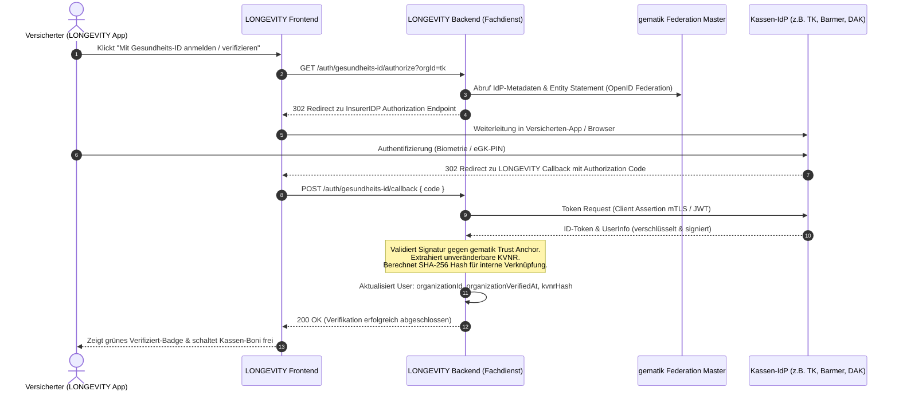

# Architektur-Zielbild: Integration der gematik Gesundheits-ID (OIDC)

## 1. Einleitung & Kontext
In Phase 1 ([Issue #53](https://github.com/Max-imalgutaussehend/LONGEVITY/issues/53)) setzt LONGEVITY auf eine pragmatische, datenschutzkonforme Verifikation der Krankenkassenmitgliedschaft:
- Auswahl der Partner-Krankenkasse aus der Plattform-Liste.
- Syntaktische & Prüfziffern-Validierung der 10-stelligen Krankenversichertennummer (KVNR) nach § 290 SGB V (Modulo 10).
- Speicherung ausschließlich als unidirektionaler kryptografischer Hash (`HMAC-SHA256(KVNR, Salt)`) gemäß Art. 9 DSGVO, um Mehrfachkonten ohne Klartextspeicherung zu verhindern.

Für den produktiven Regelbetrieb im deutschen Gesundheitswesen und den flächendeckenden Rollout mit gesetzlichen (GKV) und privaten (PKV) Krankenversicherungen ist die **Gesundheits-ID** (sektorale IdP nach gematik-Spezifikation) das definierte Architektur-Zielbild.

---

## 2. Funktionsweise der Gesundheits-ID
Seit 2024 sind alle gesetzlichen Krankenkassen in Deutschland gesetzlich verpflichtet, ihren Versicherten eine digitale Identität (**Gesundheits-ID**) bereitzustellen (§ 291 Abs. 8 SGB V).

- **Authentifizierungsmedium:** Smartphone des Versicherten (App der Krankenkasse) in Kombination mit Biometrie (FaceID / Fingerabdruck) oder PIN der elektronischen Gesundheitskarte (eGK) bzw. Personalausweis (eID).
- **Sicherheitsniveau:** Hohes Vertrauensniveau (*Substantial* / *High* gemäß eIDAS-Verordnung).
- **Protokoll:** OpenID Connect (OIDC) Profile for Identity Provider Federation (gemSpec_IDP_FD der gematik).

---

## 3. Architektur-Flow: LONGEVITY als Fachdienst

---

## 4. Datenschutz & Zero-Knowledge-Prinzip

Auch bei Einsatz der gematik Gesundheits-ID bleibt das strikte Zero-Knowledge-Prinzip von LONGEVITY gewahrt:

1. **Keine Rückkanal-Diagnostik:** Der Kassen-IdP erfährt im OIDC-Flow lediglich, dass sich der Versicherte bei LONGEVITY authentifiziert hat. Er erhält **keinen Einblick** in Vitalitäts-Scores, Messwerte oder verbundene Wearables.
2. **Keine Klartext-Persistierung:** Die aus dem ID-Token extrahierte KVNR wird vom Backend sofort gehasht (`hashKvnr(kvnr)`). Es existiert zu keinem Zeitpunkt eine Datenbank-Tabelle mit Klarnamen + Klartext-KVNR.
3. **Zweckbindung:** Die Verifikation dient ausschließlich der Feststellung der Anspruchsberechtigung für § 65a SGB V Tarife und Boni im Bereich `/vorteile`.

---

## 5. Migrationspfad von Phase 1 zu Phase 2

| Kriterium | Phase 1 (MVP - Umgesetzt) | Phase 2 (gematik Gesundheits-ID) |
|---|---|---|
| **Eingabe** | Manuelle Eingabe der KVNR im Modal | 1-Klick Weiterleitung in die Kassen-App |
| **Prüfung** | Syntaktisch & Modulo-10 (§ 290 SGB V) | Kryptografische OIDC Assertion des Kassen-IdPs |
| **Missbrauchsschutz** | Unique Hash `kvnr_hash` | Hardware-gebundene Zwei-Faktor-Authentifizierung |
| **Integrationsaufwand** | Gering (sofort einsatzbereit) | Hoch (Zulassung als Fachdienst in der TI erforderlich) |
| **Voraussetzungen** | Gültige Versichertenkarte (eGK) | Freigeschaltete Kassen-App mit Gesundheits-ID |
